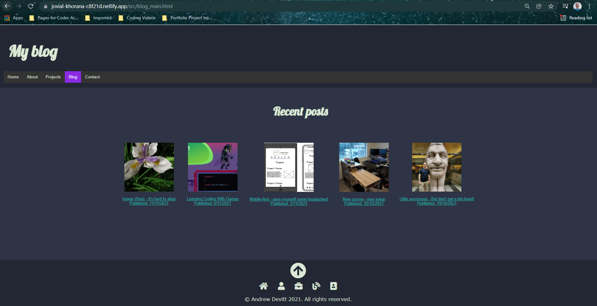

# AndrewDevitt_T1A2
## Portfolio Site
My portfolio website for Coder Academy Term 1 Assignment 2

### Link to deployed website: https://peaceful-cray-76ecab.netlify.app/

### Link to my GitHub repo: https://github.com/AnderDevitt/AndrewDevitt_T1A2

# PURPOSE
This site was created to be a portfolio of my work and projects as I progress as a full stack developer, and to showcase my skill, abilties, and experience to future potential employers.

The site will:
- present examples of my work on a projects page
- provide my contact details to employers who visit the site
- link to my professional and social media sites (GitHub and Facebook, etc.)
- show employers who I am as a person via an About Me page and a Blog

# TARGET AUDIENCE
The target audience is any potential employers looking for a junior web or full stack developer to employ. As such, it will need to remain professional in content.

Additionally, other developers and coders may visit the site.

# FUNCTIONALITY/FEATURES
## Site navigation
On screens over 600px wide (tablets and larger) the horizontal top navigation bar has page links visible. However, on mobile phones, these links disappear and are replaced by a hamburger menu.

At the bottom of the screen, icons link to each of the main pages, or users may use a button to return to the top of the page.

## Responsive design
The site was designed to be mobile friendly. On small screens (less than 600px wide) the main content area of the page will take up the entire width of the screen and contents will shrink and align vertically within a single column. The paragraph text font-size for mobiles remains larger rather than shrinking. 

As screens increase in size, the width of the content area shrinks to 70%, centralising the content for the user to view easier (no need to move their head or eyes left or right to read content). The content area also expands vertically to use up more of the space on large screens.

## External links
The Contacts page contains links to my social media and professional accounts, and my email. Each link is set to open a new tab so that potential employers are not directed away from my page. 

## PDF
The About page contains a link to my resume in pdf format. The link is set to open in a new tab.

# SITEMAP

# SCREENSHOTS
There are five sample blog pages on the site, however they all reflect the examples given below so I have only included pictures of one sample blog here.
## Desktop and tablet

## Mobile

# TECH STACK
Tech stack I worked with to produce this site:

## Code
- HTML 5
- CSS 3
- CSS Flexbox
- Javascript

## Control
- Git 
- GitHub

## Deployment
- Netlify